# `⚡ PRIYANK SAXENA`
### Software Engineer | Automation | DevOps | GenAI | LLM | Agents

<br>

<table align="center" cellpadding="14" cellspacing="0"
       style="border: 2px solid #39ff88; border-radius: 18px; background: #07110b;">
  <tr>
    <td align="center" valign="middle"
        style="border-right: 1px solid #1f9d5c; padding: 18px;">
      
    </td>

   <td align="center" valign="middle" style="padding: 18px;">
      
    </td>
  </tr>
</table>


<br>

<p align="center">     </p>

👨‍💻 About Me

I'm Priyank Saxena, a Software Engineer focused on building automation-driven solutions for enterprise IT, endpoint remediation, DevOps workflows, and cloud-native environments.

My work revolves around turning repetitive and complex operational problems into reliable, scalable and automated engineering workflows.

🔧 100+ one-click Windows endpoint troubleshooters
📦 50+ silent software installers
🍎 40+ macOS remediation solutions
🧩 200+ automation scripts across Windows & macOS
🔍 20+ RCA automation troubleshooters
☁️ Kubernetes, Docker, AWS & GitOps
📊 Patch intelligence, metadata automation & analytics
🚀 CI/CD, automation pipelines & observability
📝 Technical documentation, SOPs & solution architecture

Automation is not just about removing repetitive work — it's about building systems that make reliable work repeatable.
<br>
⚡ What I Do

<table> <tr> <td width="50%" valign="top">

🤖 Automation Engineering
Endpoint remediation
One-click troubleshooters
Silent software installation
Cross-platform automation
Diagnostic automation
Root Cause Analysis automation
CLI-based remediation
Test automation

</td>

<td width="50%" valign="top">

☁️ DevOps & Cloud
Docker
Kubernetes
Argo CD
Helm
CI/CD concepts
AWS
Linux
Infrastructure automation
Observability

</td> </tr>

<tr> <td width="50%" valign="top">
<br>
📊 Data & Intelligence
Patch intelligence
Microsoft Update metadata
Pandas
NumPy
Data analysis
Dashboards
Reporting
Automation-driven analytics

</td>

<td width="50%" valign="top">

🛠️ Engineering
Python development
PowerShell
Bash
C#
REST APIs
Flask
Selenium
BeautifulSoup
Solution architecture
RCA

</td> </tr> </table>
<br>
## 🧰 Technology Stack

💻 Languages & Scripting

<p>  </p>

Python · PowerShell · Bash · Shell Scripting · C# · JavaScript · HTML · CSS

⚙️ Automation & DevOps

<p>  </p>

Docker · Kubernetes · Git · GitHub · AWS · Microsoft Azure · Vagrant · CI/CD · GitOps

☸️ Kubernetes & Cloud-Native

<p>  </p>

Kubernetes · Kind · Helm · Argo CD · Docker · Linux · AWS

📊 Data & Analytics

<p>  </p>

Pandas · NumPy · Power BI · Data Analysis · Dashboards · Reporting · OpenPyXL · Grafana

🌐 Web, APIs & Automation

<p>
  
</p>

Flask · REST APIs · Selenium · BeautifulSoup · Postman · Bootstrap

🗄️ Databases

<p>
  
</p>

MySQL · MongoDB

🚀 Featured Engineering Work
🖥️ Enterprise Endpoint Remediation

Built large-scale automation solutions for enterprise Windows and macOS environments.

Highlights

Developed 100+ one-click Windows endpoint troubleshooters
Built 50+ silent software installers
Created 40+ macOS remediation solutions
Engineered 200+ automation scripts
Developed 20+ RCA automation troubleshooters
Automated diagnostics and remediation workflows
Reduced manual support effort and MTTR

Technologies

Python PowerShell Bash C# CLI Automation Endpoint Management

<br><br>
## 🏆 Recognition & Achievements

<table> <tr> <td align="center" width="50%">

🥇 Catalyst in Client Engagement

Workelevate

January 2025

</td>

<td align="center" width="50%">

🏆 Best Personality Award

Campus Event Winner

May 2023

</td> </tr> </table>

<br>

## 📜 Certifications & Learning
<table>
<tr>
<td>☕</td>
<td><b>Java</b></td>
<td>HackerRank</td>
</tr>
<tr>
<td>🐍</td>
<td><b>Flask Python</b></td>
<td>Great Learning</td>
</tr>
<tr>
<td>🐧</td>
<td><b>Linux Tutorial</b></td>
<td>Great Learning</td>
</tr>
<tr>
<td>🌐</td>
<td><b>Google IT Support Fundamentals</b></td>
<td>Coursera</td>
</tr>
<tr>
<td>⛓️</td>
<td><b>Blockchain Technology & Management</b></td>
<td>Amity</td>
</tr>
<tr>
<td>🐍</td>
<td><b>Python</b></td>
<td>LinkedIn</td>
</tr>
<tr>
<td>🌐</td>
<td><b>Web Development</b></td>
<td>Internshala</td>
</tr>
<tr>
<td>🎤</td>
<td><b>GDG DevFest India</b></td>
<td>GDG</td>
</tr>
</table>

<br>


## 📈 Engineering Philosophy

```text
┌──────────────────────────────────────────────────────┐
│                                                      │
│   DISCOVER  →  AUTOMATE  →  OBSERVE  →  IMPROVE      │
│                                                  ↓   │
│      Problem   ←   Solution   ←   Metrics   ←   RCA  │
│                                                      │
└──────────────────────────────────────────────────────┘
```

I enjoy working at the intersection of:

**⚡ Automation** · **⚙️ DevOps** · **☁️ Cloud** · **📊 Data** · **🤖 AI**
<br><br>
### 🎯 Engineering Principles

| ⚡ Fast | 🔁 Repeatable | 📈 Scalable | 🔍 Observable | 🛡️ Reliable | 🧩 Maintainable |
| :----: | :-----------: | :---------: | :-----------: | :----------: | :-------------: |
|  Speed |  Consistency  |    Growth   |   Visibility  |   Stability  |  Sustainability |

---
<br><br>
## 🧪 Currently Exploring

| ☁️ Cloud Engineering  |  ☸️ DevOps   |   🤖 AI & Automation   |
| :------------------:  | :-----------: | :--------------------: |
|          AWS          |   Kubernetes  |      Generative AI     |
|         Azure         |     GitOps    | Intelligent Automation |
| Google Cloud Platform |     CI/CD     |   AI-assisted DevOps   |
|   Cloud Automation    | Observability |    Automation Agents   |

<!--
📊 GitHub Activity

<p align="center">   </p>

🐍 Contribution Snake

<p align="center">  </p>
-->
<br><br>
## 📫 Connect With Me

<p align="center">

<a href="https://github.com/PriyankV25">
  
</a>

<a href="https://www.linkedin.com/in/priyanksaxenaps/">
  
</a>

<a href="https://priyank-saxena-portfolio.onrender.com/">
  
</a>

<a href="mailto:priyank.saxena.dev@gmail.com">
  
</a>

</p>

<br><br>
<p align="center">⚡ Automate. Deploy. Observe. Improve. ⚡</p>


</p>
<!--
**PriyankV25/PriyankV25** is a ✨ _special_ ✨ repository because its `README.md` (this file) appears on your GitHub profile.

